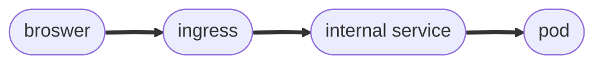

# Ingress
-  One way to access app from outside you can use *external service*. But that uses ip:port which is not convinient.
-  You will want to use domain name and secure connection using https.
-  For that we use ingress.

YAML configuration in external service vs ingress [[yaml config file]]

##### Ingress controller
- Evaluates all the rules.
- Manages redirection
- Entrypoint to the cluster.

![[Ingress_1.png]]