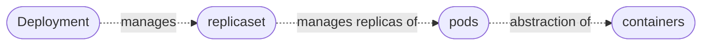

# Kubernetes Components

## Node and Pods
- Node is a server that runs the containers
- The smallest unit of K8 is pods

##### Pods
- Abstraction over containers.
- So that user interacts with the kubernetes layer and not the container directly.
- Usually 1 application  per pod.
-  Each pod gets its own IP address. 
-  If a pod restarts then a new IP is assigned to it, which causes problem

![[Node and pod.png]]

## Service and ingress
- Changing IP evertime a pod restarts is tidious job.
- To overcome it **Service** is used.
- Service provides permanent IP to the pods.
- It also acts aas load balancer between replicas of pods
- External client request first comes to **Ingress** process and then it forwards it to service process.

![[Service and ingress.png]]

Ingress explaination [[Ingress]]

Service explanation [[K8S services]]

## ConfigMap and Secret
- External configuration for your application.
- Same as configuration but stores confidential data like username and password encode in base64.

![[Configmap and secret.png]]

## Volumes
- It attackes the DB pod with a physical storage which can be local or cloud.
- K8 does not manage data persistance.

![[Volumes.png]]

[[Volumes]]

## Deployment
- We do not create replicas of same pod.
- We create a **blueprint** of the pod and specify the number of replicas we want.
- This blueprint is called **deployment**

How to create a deployment [[yaml config file]]

## StatefulSet
- We cannot replicate DB using deployment because DB has states and should be consistent after concurrent reads and writes.
- **StatefulSet** is used to deployment stateful apps like DB
- DB is mostly hosted outside the K8 cluster.

[[StatefulSet]]

## ReplicaSet
- It manages all the replicas of a deployment. 

> Everythings below deployment is managed by kubernetes. If you want to edit the image then make changes in deployment directly.