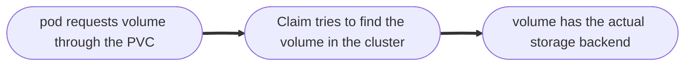

# Volumes
##### Persistant Volume
- A global cluster resource.
- Created via YAML file
	- kind: Persistant Volume
	- spec e.g. how much storage?
- Its an external plugin to the cluster.

![[NFS_storage.png]]

- Persistant volumes are not namespaced.

##### Persistant volume claims
- Created using YAML file.
- It claims the volume that satisfies the storage requirement and properties.
- If there are many persistant volumes with different sizes then it will claim that PV with minimum storage that satisfies the claim.



- Claims must exist in the same namespace as the pod that is using it.

```
apiVersion:v1
kind:Pod
metadata:
  name:mypod
spec:
  containers:
      name:myfrontend
      image:nginx
      volumeMounts:
      -mountPath:"/var/www/html"
        name:mypd
      name:mypd
      persistentVolumeClaim:
        claimName:pvc-name
  volumes:
```


- Admin creates PV.
- User creates PVCs.

### Storage Class
- SC provisions PV **dynamically** when PVC claims it.
- We dont need to create a PV before deploying a pod.
- We can create a StorageClass config with the Storagebackend that is to be used to create PVs. It is defined using the attribute provisioner.
- In the PVC of the pod itself, we can link the StorageClass config file.
- Then the StorageClass will create s PV that will satisfiy the claims of PVC.


