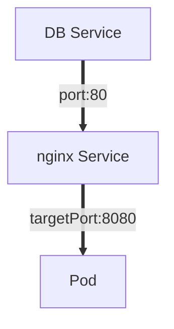

# YAML file syntax

```
apiVersion:apps/v1
kind:Deployment
metadata:
  name:nginx-deployment
  labels:
   app:nginx
spec:
  replicas:1
  selector:
    matchLabels:
      app:nginx
  template:
   metadata:
      labels:
        app:nginx
    spec:
      containers:
      -name:nginx
        image:nginx:1.16
        ports:
          containerPort:80
```

-> *kind* tells us what type of component must be created using the *create* command.
-> First *spec* is for deployment
-> Second *spec* is for the pod.

 1.  **MetaData** -> Metadata of the component we are creating.
 2.  **Specification** -> Attributes of the *spec* are *specific* to the kind of component we are creating.
 3.  **Status** -> Automatically generated and added by k8s. When we will *apply* this config then k8s will add the status to config file. This data comes from *etcd*.

#### Blueprint for pods
- In deployment spec there is a *template(blueprint)** of the pod.
- *Template* has its own *metadata* and *spec* section.
- Second *spec* is blueprint of a pod

```

 apiVersion:apps/v1
 kind:Deployment
 metadata:
   name:nginx-deployment
   labels:...
   replicas:2
 > selector:...
   template:
     metadata:
       labels:
 spec:
        app:nginx
     spec:
       containers:
       - name:nginx
         image:nginx:1.16
         ports:
         - containerPort:8080
```
Deployment config.

```
apiVersion:v1
kind:Service
metadata:
spec:
  name:nginx-service
  selector:
    app:nginx
> ports:
	-	protocol: TCP
		port: 80
		targetPort: 8080
```
Service config.


#### Connecting components

##### Labels and Selectors
-  Metadata gives deployment its name.
-  *Labels* is a key-value pair and it sticks with its component.
-  *.spec.selector* is a list of labels pods must have for the deployment to manage them. Deployment selecotr matchs all the labels of the pods that are down in the template.
-  Deployment has its own label. This is to connect the service with the deployment or its pods.
-  So the service config file has a selector in its spec section and it will connect to the deployment having the same label.
-  *port* attribute in spec section of service config fille tells us the port on which that service is listening for incoming requests.
-  *targetPort* is the port number of the pod to which it should forward the request to




### YAML config of external service vs ingress

```
apiVersion:v1
kind:Service
metadata:
  name:myapp-external-service
spec:
  selector:
    app:myapp
  type:LoadBalancer
 ports:
      protocol:TCP
      port:8080
      targetPort:8080
      nodePort:35010
```
YAML config for exteranl service

```
apiVersion:networking.k8s.io/v1betal
kind:Ingress
metadata:
  name:myapp-ingress
spec:
  rules:
  -host:myapp.com
    http:
      paths:
      -backend:
          serviceName:myapp-internal-service
          servicePort:8080
```

- Rules are routing rules
- All the request to the *host* should be forwarded to the *service* having serviceName.
- Host name should be mapped to the IP address of the entrypoint node.
- 